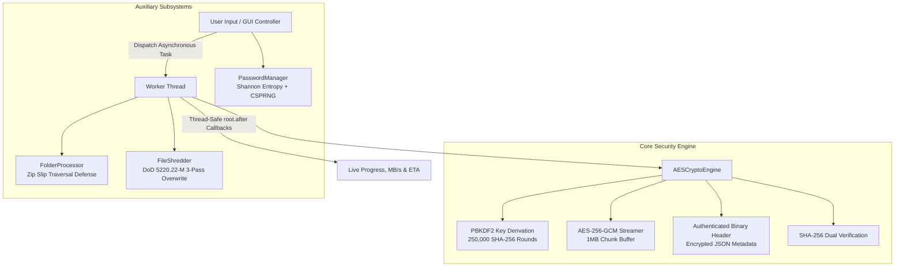

# 🎯 Complete Interview Preparation & Technical Deep-Dive Guide
## AES-256-GCM Enterprise Cryptographic Suite

Aap is guide ko padh kar kisi bhi **Software Engineering, Cybersecurity, ya Python Backend / Systems** ke interview me is project ko confidentally explain kar sakte hain.

---

## 📑 Quick Project Elevator Pitch (30-Second Pitch)

> *"Maine ek high-performance, NIST SP 800-38D compliant **AES-256-GCM Cryptographic Suite** build kiya hai. Isme Galois/Counter Mode (AEAD) use hua hai jo confidentiality aur tamper-evident cryptographic authenticity dono ensure karta hai. Iska architecture **O(1) constant-memory streaming** par chalta hai, jisse multi-gigabyte files bina memory spike ke process ho jaati hain. Saath hi isme **DoD 5220.22-M 3-pass file shredding**, **Shannon entropy password analyzer**, **Zip Slip traversal protection**, aur non-blocking **multithreaded CustomTkinter GUI** implement kiya hai."*

---

## 🏛️ High-Level Architecture Diagram



---

## 💡 Top 10 Technical Interview Questions & Answers

### Q1. Why did you choose AES-256-GCM instead of AES-CBC or AES-CTR?
**Answer:**
- **AES-CBC** (Cipher Block Chaining) requires padding (PKCS#7) and is notoriously vulnerable to **Padding Oracle Attacks** (like POODLE) if error messages leak padding validity. Moreover, CBC alone only provides **Confidentiality**, not **Integrity** or **Authenticity**. To make CBC secure, you must manually apply "Encrypt-then-MAC" (HMAC-SHA256), which adds complexity.
- **AES-GCM** (Galois/Counter Mode) is an **AEAD (Authenticated Encryption with Associated Data)** cipher. It combines CTR mode for high-speed parallel encryption with a Galois field multiplier (GHASH) to generate an unforgeable **128-bit authentication tag**. If an attacker alters even a single bit in the ciphertext or file header, `cipher.verify(tag)` immediately fails with an authentication error, preventing **Bit-Flipping** and **Chosen-Ciphertext Attacks (CCA)**.

---

### Q2. Why did you use a 12-byte (96-bit) Nonce instead of 16 bytes?
**Answer:**
According to **NIST SP 800-38D**:
- AES-GCM natively uses a 96-bit nonce. When a 12-byte nonce is provided, the cipher directly appends a 32-bit counter starting at 1 (`J0 = Nonce || 0^31 || 1`).
- If you pass an IV of any other length (e.g., 16 bytes), the algorithm has to compute GHASH over the IV first to compress it down to 128 bits, which incurs a performance penalty and theoretically introduces a slight collision probability in GHASH. Therefore, 12 bytes is the cryptographically recommended optimal size.

---

### Q3. How does your design achieve O(1) constant memory complexity?
**Answer:**
If we did `file.read()`, a 10 GB file would load 10 GB into RAM, immediately throwing a `MemoryError` (Out of Memory crash).
- In our engine, we use **Chunked Stream Processing** with a fixed buffer size of `1 MB` (`CHUNK_SIZE = 1024 * 1024`):
  ```python
  while chunk := src.read(CHUNK_SIZE):
      enc_chunk = cipher.encrypt(chunk)
      dst.write(enc_chunk)
  ```
- Memory usage stays strictly under ~15-20 MB regardless of whether the file being encrypted is 50 KB or 100 GB.

---

### Q4. How did you solve the GUI freezing problem (Concurrency)?
**Answer:**
- In Tkinter / GUI frameworks, the main thread executes the event loop (`mainloop`). Running a heavy I/O and cryptographic operation on the main thread causes the OS to report the window as "Not Responding".
- **Solution**: We decoupled I/O using Python's `threading.Thread(target=worker, daemon=True)`.
- **Thread Safety**: Tkinter widgets are not thread-safe. To prevent race conditions and crashes, background threads communicate UI updates back to the main thread using `self.after(0, lambda: self._update_vault_progress(...))`, ensuring all GUI manipulations execute on the main thread.
- **Cancellation**: We passed a `threading.Event()` token (`cancel_event`). At each chunk iteration, the worker checks `cancel_event.is_set()`. If cancelled, it halts immediately, closes handles, and securely deletes the partial output file to prevent dirty state.

---

### Q5. What is the DoD 5220.22-M sanitization standard, and how did you implement it?
**Answer:**
The **National Industrial Security Program Operating Manual (DoD 5220.22-M)** defines secure data wiping to prevent forensic recovery of magnetic storage media:
1. **Pass 1**: Overwrite all addressable locations with binary zeros (`0x00`).
2. **Pass 2**: Overwrite all addressable locations with binary ones (`0xFF`).
3. **Pass 3**: Overwrite all addressable locations with cryptographically secure random pseudo-noise (`os.urandom()`).
4. **Metadata Eradication**: Overwrite and rename the file on the filesystem directory entry before unlinking (`os.remove()`). We also call `os.fsync(f.fileno())` to force OS write buffers to flush to physical hardware.

---

### Q6. How does your Password Entropy Analyzer work mathematically?
**Answer:**
We implemented two complementary metrics:
1. **Information Entropy (Pool Diversity)**:
   $$E = L \times \log_2(R)$$
   Where $L$ is the character length and $R$ is the size of the character pool (lowercase 26, uppercase 26, digits 10, symbols 32 $\rightarrow R \approx 94$).
2. **Shannon Entropy (Distribution Diversity)**:
   $$H = -\sum_{i=1}^{n} P(x_i) \log_2 P(x_i)$$
   Where $P(x_i)$ is the frequency probability of character $x_i$. This ensures passwords with repeated characters (e.g., `aaaaaaaaaaaa`) don't get a false "Strong" rating because their Shannon entropy drops close to 0.
3. For password generation, we use Python's `secrets` module (which taps into `/dev/urandom` or Windows `CryptGenRandom`), avoiding weak PRNGs like `random.random()`.

---

### Q7. What is the Zip Slip vulnerability and how did you defend against it?
**Answer:**
- **Zip Slip** is a critical directory traversal vulnerability where a malicious archive contains filenames like `../../../../Windows/System32/evil.dll`. When extracted, it escapes the target directory and overwrites critical system files.
- **Our Defense**:
  ```python
  target_path = os.path.abspath(os.path.join(destination_dir, member.filename))
  if not target_path.startswith(destination_dir + os.sep):
      raise SecurityError("Zip Slip directory traversal detected!")
  ```
  We canonicalize the target destination using `os.path.abspath` and verify that the target path remains strictly a child of the trusted destination directory.

---

### Q8. Why did you use PBKDF2 with 250,000 iterations?
**Answer:**
Symmetric ciphers like AES require a high-entropy 256-bit key. Human passwords have low entropy.
- **PBKDF2-HMAC-SHA256** repeatedly computes HMAC across 250,000 iterations with a unique 16-byte random salt.
- The 16-byte salt prevents **Precomputed Rainbow Table** attacks.
- The 250,000 iterations introduce a deliberate, controllable computational delay (~150ms per key derivation), making offline brute-force attacks with GPUs/ASICs prohibitively expensive (e.g. testing 1 billion passwords would take years instead of seconds).

---

### Q9. How do you ensure backward compatibility?
**Answer:**
We structured our binary header with version negotiation:
- `MAGIC_V2 = b"AESGCM"` (Version 2 with encapsulated metadata, folder trees, and hashes).
- `MAGIC_V1 = b"AES256"` (Legacy Version 1).
When opening an encrypted file, the engine reads the first 6 bytes and version byte. If an older V1 file is detected, it automatically routes through `_decrypt_v1()`, ensuring legacy user data is never broken.

---

### Q10. What happens if a file is tampered with during transit?
**Answer:**
- The engine computes a dual layer of integrity verification:
  1. The AES-GCM 128-bit authentication tag is verified with `cipher.verify(tag)`.
  2. The decrypted plaintext's SHA-256 checksum is compared against the unforgeable hash stored in the encrypted header.
- If even a single byte is modified or corrupt, `cipher.verify()` throws a `ValueError`.
- The engine's atomic rollback mechanism instantly deletes the partial output file, ensuring corrupted or adversary-modified payloads never touch the user's filesystem.

---

## 💼 Keywords to Mention in Interviews
- **AEAD**: Authenticated Encryption with Associated Data
- **NIST SP 800-38D**: National Institute of Standards & Technology AES-GCM specification
- **CSPRNG**: Cryptographically Secure Pseudorandom Number Generator
- **O(1) Streaming**: Constant RAM buffer chunking
- **DoD 5220.22-M**: US Department of Defense data sanitization standard
- **Zip Slip**: Directory traversal extraction vulnerability
- **Shannon Entropy**: Mathematical measurement of information density
- **Defense in Depth**: Multiple security layers (GCM tag + SHA-256 + PBKDF2)
