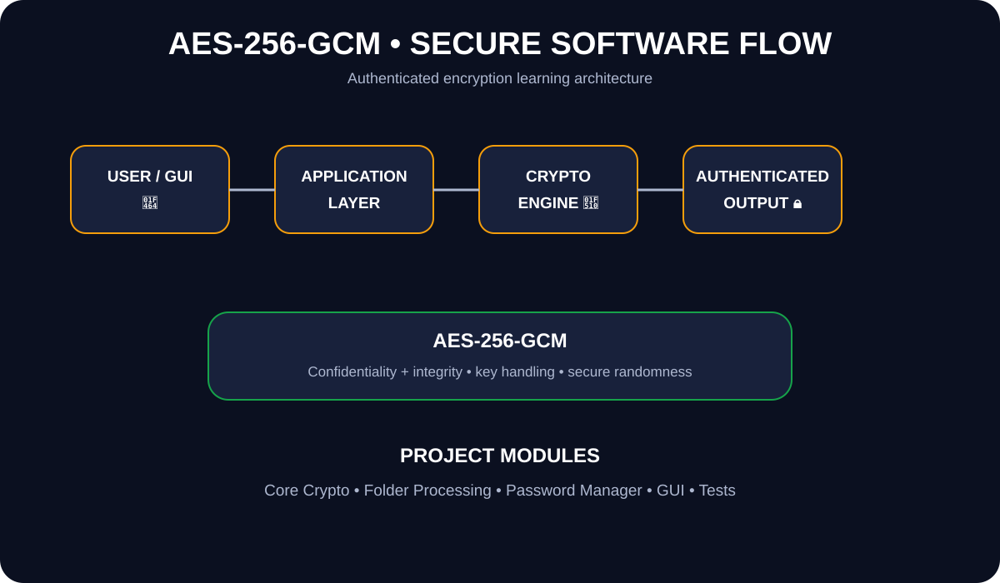

<div align="center">


[](https://www.python.org/)
[](https://csrc.nist.gov/publications/detail/sp/800-38d/final)
[](#-testing)
[](#)

</div>

---

## 🔐 Overview

A Python-based educational project demonstrating **AES-256-GCM authenticated encryption**, secure software design concepts, password/key handling, and modular application architecture.

> 🧠 **Learn cryptography by understanding the design—not by reinventing production security.**

## 🎨 Project Visual

<p align="center">
  
</p>

> **Visual:** User/GUI → application layer → crypto engine → authenticated output.

---

## ✨ Highlights

| 🔐 | Capability | Purpose |
|---|---|---|
| 🛡️ | AES-256-GCM | Authenticated encryption concepts |
| 🧩 | Key Handling | Password-derived key learning |
| 🎲 | Secure Randomness | Cryptographic randomness concepts |
| 🖥️ | Desktop UI | Application-oriented learning |
| 🧪 | Testing | Validate core functionality |
| 📚 | Documentation | Understand the security design |

## 🏗️ Architecture

```text
             👤 USER
                │
                ▼
        ┌───────────────┐
        │  Desktop GUI  │
        └───────┬───────┘
                ▼
        ┌───────────────┐
        │ Application   │
        │     Layer     │
        └───────┬───────┘
          ┌─────┼─────┐
          ▼     ▼     ▼
       🔐 Crypto  📁 Files  📊 Utilities
          │     │     │
          └─────┼─────┘
                ▼
          AES-256-GCM
                │
                ▼
        🔒 Authenticated Output
```

## 🛠️ Technology Stack

<p align="center">

</p>

## 📂 Project Structure

```text
AES/
├── core/
│   ├── crypto_engine.py
│   ├── folder_processor.py
│   ├── password_manager.py
│   └── shredder.py
├── gui/
│   └── app.py
├── tests/
│   └── test_crypto.py
├── main.py
├── requirements.txt
├── INTERVIEW_GUIDE.md
└── README.md
```

## ⚙️ Installation

```bash
git clone https://github.com/sakshi01-art/AES.git
cd AES
python -m venv venv
```

### Windows

```bash
venv\Scripts\activate
```

Install dependencies:

```bash
pip install -r requirements.txt
```

## 🧪 Testing

```bash
python -m unittest discover -s tests -v
```

## 🗺️ Roadmap

- [x] AES-256-GCM application foundation
- [x] Modular documentation
- [x] Automated test foundation
- [x] Animated project presentation
- [ ] Expand test coverage
- [ ] Add CI checks
- [ ] Improve accessibility and error handling
- [ ] Add screenshots / demo GIF

## 🔒 Security Notes

AES-GCM provides confidentiality and integrity when used correctly. Production systems should rely on well-reviewed cryptographic libraries, safe key management, secure nonce handling, and professional security review.

This repository is a **learning project**, not a replacement for production security engineering.

## ⚠️ Responsible Use

Use this project only with data and systems you are authorized to work with.

## 👩‍💻 Author

**Sakshi Taragi**

[](https://github.com/sakshi01-art)
[](https://www.linkedin.com/in/sakshi-taragi-6aa019435)

<div align="center">


⭐ **Learn secure. Build smart.** 🔐

</div>


---

## 🔥 Latest Update — 20 September 2026

- Refreshed the project documentation and presentation.
- Kept the architecture and development roadmap clear for future modules.
- Continuing practical implementation and incremental improvements.


## 🔥 Latest Update — 22 September 2026

- Added AES-256-GCM design notes under `docs/`.
- Documented confidentiality, authentication, nonce handling, and testing priorities.
- Continued the project as an educational secure-software implementation.

## 🚀 Development Update — 22 September 2026

- Clarified the educational focus on authenticated encryption and secure software design.
- Highlighted testing, error handling, and safe key/nonce practices as the next development areas.
- Kept production-security limitations clearly documented.

---

## 🚀 Development Update — 24 September 2026

- Refined the authenticated-encryption learning roadmap.
- Added clearer checkpoints for input validation, error handling, testing, and secure configuration.
- Kept the implementation focused on learning AES-GCM concepts without presenting it as production security software.

---

## ✨ Development Update — 26 September 2026

- Refreshed the project documentation for the latest development stage.
- Kept the roadmap focused on practical implementation, testing, and continuous improvement.
- Updated the project progress section so the repository stays current and easy to review.
